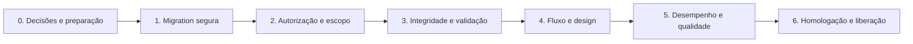

# MACETE no Diário Eletrônico — Plano de Melhorias por Etapas

Status: em execução — etapas 1 e 2 implementadas em código; etapa 3 parcial.

Base: revisão de código e design realizada em 29/07/2026.

Este plano organiza a evolução do módulo `app/modules/macete` de modo que os
riscos para dados e permissões sejam resolvidos antes de melhorias visuais ou
de produtividade. O módulo não deve ser considerado pronto para uso em
produção antes da conclusão das etapas 1 a 3.

## Execução atual

- Criada a migration segura
  `app/migrations/3.14.20/macete_lesson_plan_safe.sql`. Ela não apaga dados e
  deve ser usada em novas instalações; a migration legada 3.13.13 não foi
  executada nem alterada.
- Implementado o escopo de escola, ano letivo e autor docente para carregar
  planos, registros e turmas, além da validação das features do Diário
  Eletrônico nos endpoints MACETE.
- Protegidos os atributos de propriedade contra alteração via POST e incluídas
  validações de compatibilidade entre plano, turma, etapa e data da aula.
- O plano agora registra uma lista de pares etapa–componente curricular; cada
  componente é carregado conforme a etapa selecionada.
- Os campos narrativos pedagógicos usam Quill 2.0.3 localmente, com
  formatação segura e fallback em `textarea` quando JavaScript estiver
  indisponível.
- Permanecem pendentes as decisões funcionais da etapa 0, a revisão visual da
  etapa 4 e os testes automatizados da etapa 5.

## Resultado esperado

Ao final, professores e equipes autorizadas poderão criar, consultar, editar e
registrar aulas MACETE somente no seu escopo permitido, sem associação
inconsistente entre plano, turma e etapa. As telas devem manter o design system
TAG, orientar o preenchimento e continuar utilizáveis em telas menores.

## Ordem de execução

## Etapa 0 — Decisões e preparação

Objetivo: confirmar regras de produto que afetam autorização e ciclo de vida.

- Definir quais perfis podem criar, alterar, concluir e excluir planos e
  registros MACETE.
- Confirmar se as features existentes (`FEAT_DIARY_LESSON_PLAN` e
  `FEAT_DIARY_CLASSES`) controlam o acesso ou se serão criadas features
  específicas.
- Definir se um plano concluído/registrado pode voltar a rascunho e quem pode
  aprová-lo.
- Confirmar a regra de compatibilidade: um registro deve usar uma turma cuja
  etapa pertença às etapas selecionadas no plano.
- Verificar se a migration MACETE já foi executada em algum ambiente e criar
  backup antes de qualquer correção estrutural.

Critério de aceite: regras registradas na issue/PR e validadas pelo responsável
funcional do Diário Eletrônico.

## Etapa 1 — Migration segura

Objetivo: tornar a evolução de banco não destrutiva e reproduzível.

Problema atual: `app/migrations/3.13.13/macete_lesson_plan.sql` contém
`DROP TABLE` para tabelas do domínio e recria `macete_lesson_plan_stage`, que
também possui uma migration separada. Isso pode apagar dados e, em uma base que
já tenha a tabela de etapas, impedir a exclusão do plano por chave estrangeira.

Implementação:

1. Não editar uma migration já aplicada em ambiente compartilhado. Criar uma
   nova migration SQL na versão de release corrente.
2. Remover o comportamento destrutivo do fluxo de instalação: usar apenas
   `CREATE TABLE IF NOT EXISTS`, `ALTER TABLE` idempotente e verificações de
   existência quando aplicável.
3. Consolidar a responsabilidade da tabela `macete_lesson_plan_stage`: manter
   uma única migration de criação e, se necessária, uma migration posterior de
   dados para preencher etapas dos planos já existentes.
4. Validar a ordem de FKs e índices em banco vazio e em banco com dados.
5. Executar primeiro `composer run migrate:dry <arquivo> -- --dry-run`.

Critério de aceite:

- Nenhuma migration do MACETE executa `DROP TABLE` ou remove dados de negócio.
- A instalação em banco vazio e a atualização de banco existente completam sem
  erro de FK.
- Os planos, registros e relações pré-existentes permanecem intactos após a
  atualização.

## Etapa 2 — Autorização e isolamento de dados

Objetivo: impedir leitura ou alteração fora da escola e das permissões do
usuário.

Implementação:

1. Criar um resolvedor de escopo reutilizável, preferencialmente em serviço ou
   componente do módulo, para aplicar escola, ano letivo e regra de docente.
2. Alterar os carregamentos por ID de plano e registro para exigir o escopo
   atual; retornar 404 quando o recurso não pertencer ao usuário/escola.
3. Aplicar a mesma regra a `getPlan`, à pré-seleção `lessonPlanId` e a todos os
   endpoints JSON.
4. Validar feature/permissão no controller ou filtro do módulo, não somente na
   visibilidade do menu.
5. Usar uma lista explícita de atributos editáveis nos serviços. Em atualizações,
   nunca aceitar `school_inep_fk`, `users_fk` ou `school_year` do POST.
6. Definir a exceção para perfis administrativos de rede, caso exista, de forma
   explícita e testada.

Critério de aceite:

- Um professor não consegue acessar, alterar nem excluir registros de outro
  professor quando a regra de autoria se aplicar.
- Um usuário de outra escola recebe 404/403 para IDs externos, inclusive nos
  endpoints JSON.
- Um POST alterado manualmente não muda escola, autor ou ano letivo.
- Acesso direto por URL respeita as mesmas features exibidas no menu.

## Etapa 3 — Integridade pedagógica e validações

Objetivo: garantir que os dados registrados representem uma aula possível e
coerente com o plano.

Implementação:

1. Ao salvar registro, carregar plano e turma dentro do escopo atual; rejeitar
   IDs inexistentes ou externos.
2. Confirmar que a etapa da turma está entre as etapas selecionadas pelo plano.
   Não substituir silenciosamente a etapa do registro.
3. Ao trocar o plano na tela, preencher a turma padrão quando houver uma e
   informar claramente quando o usuário precisa escolher uma turma compatível.
4. Filtrar a lista de turmas por escola, ano, perfil docente e etapas do plano.
5. Adicionar validação de data real no formato `dd/mm/aaaa` e persistir apenas
   a data convertida para `Y-m-d`.
6. Restringir status e tipos de seção/material aos valores definidos pelo
   domínio; implementar transições válidas de status.
7. Validar habilidades BNCC contra o componente/etapa quando esta regra estiver
   disponível no cadastro de habilidades.

Critério de aceite:

- Não é possível salvar um registro com plano, turma ou etapa incompatíveis.
- Datas inválidas retornam mensagem de campo e não são persistidas.
- Um plano registrado não retorna a rascunho sem a transição autorizada.
- O resumo da tela e os valores efetivamente gravados mostram a mesma etapa,
  turma e componente.

## Etapa 4 — Fluxo e design das páginas

Objetivo: reduzir esforço de preenchimento e alinhar integralmente as páginas
ao design system TAG.

Implementação:

1. Nas abas do plano, incluir ações "Anterior" e "Próxima", indicação de
   progresso e destaque de campos obrigatórios pendentes.
2. Tornar as abas acessíveis: semântica `tablist`/`tab`/`tabpanel`, estados
   `aria-selected`, foco controlado e navegação por teclado.
3. Ajustar a mensagem de resumo para refletir o status selecionado ou remover o
   seletor quando o fluxo exigir rascunho inicial obrigatório.
4. Substituir `row-fluid`, `span12`, `alert` e estilos inline nas páginas novas
   por classes TAG já verificadas; mover regras repetidas para
   `sass/scss/components/_macete.scss`.
5. Adicionar estados vazios nas listagens e confirmação textual acessível para
   exclusão.
6. Revisar responsividade: o resumo lateral deve ser apresentado abaixo do
   formulário em telas menores, em vez de apenas desaparecer quando ele for
   necessário para conferência.
7. Após qualquer alteração SCSS, executar `composer run sass:build`.

Critério de aceite:

- O preenchimento completo pode ser feito por teclado e em viewport móvel.
- O usuário sabe em qual etapa está e como avançar/voltar sem procurar abas.
- Não permanecem estilos inline não triviais ou novos componentes Bootstrap nas
  páginas MACETE.
- O status exibido, a ajuda contextual e o comportamento de salvamento não se
  contradizem.

### Especificação — editor de texto pedagógico

Objetivo: melhorar a legibilidade de planos e registros sem permitir conteúdo
ativo ou formatação incompatível com a plataforma.

Escopo ativo:

- Plano: contexto do território, objeto do conhecimento, fases da metodologia,
  contextualização por etapa, objetivos, recursos, descrição de materiais,
  adaptações, avaliação e referências.
- Registro de aula: conteúdo executado, metodologia aplicada, avaliação e
  adaptações realizadas.

Comportamento:

1. O Quill 2.0.3 é distribuído localmente em `themes/default/js/quill.min.js`,
   com o tema Snow em `themes/default/css/quill.snow.css`. A barra oferece
   negrito, itálico, listas com marcadores, listas numeradas, link e limpeza de
   formatação.
2. A colagem usa texto simples; imagens, tabelas, anexos, estilos e HTML livre
   não são aceitos nesta versão.
3. Sem JavaScript, o campo permanece como `textarea` e pode ser preenchido e
   salvo normalmente.
4. No envio, o conteúdo do editor é copiado para o `textarea` original, de modo
   que controllers e serviços mantenham o contrato atual de POST.
5. No servidor, somente `p`, `div`, `br`, `strong`, `b`, `em`, `i`, `ul`, `ol`,
   `li` e links `http`, `https` ou `mailto` são preservados. Os demais elementos
   e atributos são removidos, exceto `data-list` controlado pelo Quill nas listas;
   links abrem em nova aba com `noopener`.

Critério de aceite:

- A formatação permitida persiste após salvar e reabrir o formulário.
- Um HTML com `script`, evento inline, imagem ou URL `javascript:` não é
  persistido como conteúdo executável.
- O formulário continua salvando textos quando JavaScript está indisponível.

## Etapa 5 — Desempenho, testes e manutenção

Objetivo: preparar o módulo para uso contínuo em escolas com muitos registros.

Implementação:

1. Paginar as listagens de planos e registros; preservar filtros na navegação.
2. Carregar relações necessárias (`usuário`, `turma`, `componente`, `etapas` e
   habilidades) de forma antecipada para evitar consultas por linha na grade.
3. Substituir `YEAR(lesson_date) = :year` por intervalo de datas para permitir
   melhor uso do índice de data.
4. Criar testes de serviço/controller para escopo, atributos imutáveis,
   compatibilidade plano–turma–etapa, transição de status e data inválida.
5. Atualizar `docs/modules/macete_lesson_plan.md` após as decisões da etapa 0,
   sem descrever como ativo o que ainda estiver pendente.

Critério de aceite:

- As grades paginam e não apresentam regressão evidente com volume.
- Os cenários críticos de autorização e integridade possuem testes automatizados.
- `composer run lint`, `composer run analyse` e `composer run mess` foram
  executados ou suas limitações foram registradas no PR.

## Etapa 6 — Homologação e liberação

Objetivo: validar o fluxo real de ponta a ponta antes de disponibilizar o
módulo.

Cenários mínimos:

1. Professor cria plano com mais de uma etapa e habilidades BNCC.
2. Professor cria registro a partir do plano e com turma compatível.
3. Professor tenta acessar ID de outra escola e é bloqueado.
4. Gestor autorizado consulta e realiza as ações previstas na etapa 0.
5. Usuário salva data inválida, turma incompatível e status não permitido; cada
   tentativa deve ser recusada com mensagem clara.
6. Fluxo completo em tela desktop e móvel, com navegação apenas por teclado.

Antes de E2E, solicitar URL base, credenciais de teste, dados de pré-condição e
aprovação do plano de testes, conforme as regras do repositório.

Critério de aceite: todos os cenários obrigatórios aprovados em homologação,
sem migration destrutiva e com evidência de verificação anexada ao PR.

## Priorização para o backlog

| Prioridade | Entregas |
| --- | --- |
| P0 — bloqueia uso | Etapas 1 e 2 |
| P1 — antes de homologar | Etapa 3 |
| P2 — experiência de uso | Etapa 4 |
| P3 — escala e evolução | Etapa 5 |
| Gate de liberação | Etapa 6 |
