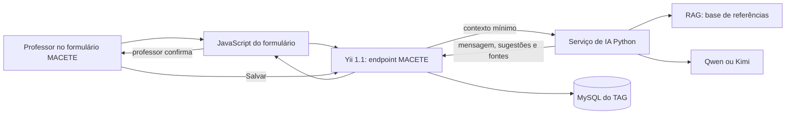

# Assistente pedagógico com IA para o MACETE

Status: especificação de arquitetura — não implementado.

Data: 2026-07-31.

## Objetivo

Oferecer, no formulário de plano de aula MACETE, uma conversa orientada à elaboração pedagógica. O assistente deve considerar referências curriculares aprovadas, como a BNCC, e sugerir conteúdo que o professor pode revisar e aplicar ao rascunho.

O assistente não salva, aprova, publica nem altera um plano por conta própria. O TAG continua sendo a fonte de verdade dos planos, das habilidades, das permissões e dos dados escolares.

## Decisão arquitetural

O agente será um serviço interno independente do TAG, implementado em Python. A integração ocorre exclusivamente por HTTPS autenticado entre o módulo `app/modules/macete` e a API do serviço.

O serviço de IA não possui acesso ao MySQL do TAG e não recebe credenciais de banco do TAG.

## Documentos desta especificação

| Documento | Responsabilidade |
| --- | --- |
| [01-servico-agente-rag.md](01-servico-agente-rag.md) | Arquitetura, componentes e comportamento do serviço Python. |
| [02-contrato-tag-servico.md](02-contrato-tag-servico.md) | Contrato HTTP, autenticação e responsabilidades do TAG. |
| [03-base-de-conhecimento.md](03-base-de-conhecimento.md) | Ingestão, curadoria, recuperação e governança das referências. |
| [04-frontend-macete.md](04-frontend-macete.md) | Chat, aplicação de sugestões e estados da interface. |
| [05-seguranca-operacao-e-qualidade.md](05-seguranca-operacao-e-qualidade.md) | Privacidade, auditoria, observabilidade, testes e implantação. |
| [06-backlog-de-implementacao.md](06-backlog-de-implementacao.md) | Tarefas executáveis, dependências e critérios de aceite. |

## Escopo da primeira entrega

- Chat síncrono, sem streaming.
- Um agente pedagógico para planos MACETE.
- Contexto do plano em edição, habilidades selecionadas e referências curriculares aprovadas.
- Sugestões estruturadas para campos existentes do plano.
- Exibição das fontes recuperadas.
- Persistência de conversa no banco próprio do serviço.
- Qwen ou Kimi selecionado por configuração de ambiente.

## Fora do escopo inicial

- Alterar ou ler diretamente o banco do TAG pelo serviço de IA.
- Enviar dados de estudantes ao serviço de IA.
- Publicar planos sem intervenção humana.
- Pesquisa livre na internet pelo agente.
- Multiagentes, execução autônoma de ferramentas ou geração em streaming.
- Fine-tuning de modelos.

## Premissas a validar antes do desenvolvimento

1. A rede define quais referências, versões e documentos locais podem compor a base ativa.
2. A área responsável aprova o tratamento, a retenção e a transferência internacional dos dados institucionais eventualmente enviados aos provedores de modelo.
3. São disponibilizadas credenciais de API para o provedor escolhido e um ambiente de homologação.
4. As regras de acesso ao plano existentes no MACETE permanecem a barreira de autorização no TAG.
