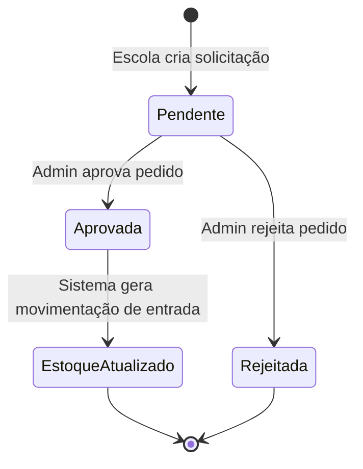
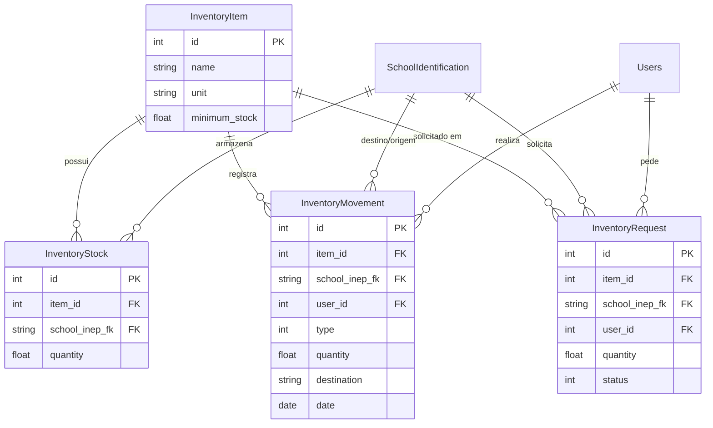

# Módulo de Almoxarifado (Inventory) - Visão de Domínio

O módulo de Almoxarifado é responsável pelo controle de estoque de materiais nas escolas e no Almoxarifado Central (Secretaria de Educação). Ele permite gerenciar entradas e saídas, transferências entre unidades e requisições de materiais.

## Funcionalidades Principais

### 1. Gestão de Itens e Estoque
- **Cadastro de Itens**: Permite registrar os produtos, informando nome, unidade de medida (ex: Kg, Unidade, Pacote) e definição de um **estoque mínimo** para gerar alertas.
- **Controle por Unidade**: O estoque é controlado individualmente por escola ou de forma global para a Secretaria de Educação (Almoxarifado Central).
- **Alertas de Estoque Baixo**: O painel exibe um alerta automático sempre que a quantidade de um item atinge ou fica abaixo do estoque mínimo configurado.

### 2. Movimentações de Estoque
- **Entradas e Saídas**: Permite registrar a adição ou remoção de materiais, justificando a origem ou destino.
- **Transferências**: Permite à Secretaria de Educação enviar materiais do Almoxarifado Central diretamente para as escolas. Isso debita do estoque central e credita no estoque da escola automaticamente.
- **Histórico**: Mantém um log detalhado de todas as operações, registrando o usuário logado, a data, o tipo de movimento (entrada/saída) e a quantidade alterada.

### 3. Requisições de Materiais
- As escolas podem criar solicitações "pedidos" de materiais para a Secretaria de Educação.
- As requisições ficam com status "Pendente" até que a administração avalie.
- **Aprovação**: Quando o gestor aprova uma requisição, o sistema automaticamente gera uma movimentação de entrada no estoque da escola que fez o pedido.
- **Rejeição**: A administração pode negar o pedido, incluindo uma observação na resposta.

#### Fluxo de Solicitação de Material

![Tela de Solicitações] (Placeholder para captura de tela: Lista de Solicitações)

## Perfis e Regras de Negócio
- **Gestores Escolares (Managers)**: Só podem ver, movimentar e gerenciar o estoque da **sua própria escola**. Podem realizar novos pedidos para o Almoxarifado Central.
- **Administradores (Secretaria)**: Possuem visão abrangente, podendo gerenciar estoques de qualquer unidade, autorizar requisições das escolas e realizar transferências diretas do estoque central para as escolas.
# Módulo de Almoxarifado (Inventory) - Visão Técnica

O módulo de Almoxarifado (`app/modules/inventory/`) gerencia a entrada, saída, transferência e requisição de materiais no sistema.

## Arquitetura e Componentes

#### Diagrama de Entidade-Relacionamento (ERD)

### Entidades do Banco (Models)
*   **`InventoryItem` (`inventory_item`)**: Representa o catálogo de produtos disponíveis.
    *   `name`: Nome do item.
    *   `unit`: Unidade de medida (Kg, Unidade, etc).
    *   `minimum_stock`: Estoque mínimo configurado para geração de alertas.
*   **`InventoryStock` (`inventory_stock`)**: Armazena a quantidade disponível de cada item por escola.
    *   `item_id`: FK para `InventoryItem`.
    *   `school_inep_fk`: FK para a escola (`SchoolIdentification`). Se for `NULL`, representa o Almoxarifado Central (Secretaria).
    *   `quantity`: Quantidade total em estoque.
*   **`InventoryMovement` (`inventory_movement`)**: Log de transações de entrada e saída.
    *   `item_id`, `school_inep_fk`, `user_id`: Associa a movimentação ao item, escola e usuário.
    *   `type`: Constantes `TYPE_ENTRY` (1) ou `TYPE_EXIT` (2).
    *   `quantity`: Valor movimentado.
    *   `destination`: Justificativa (Origem/Destino).
*   **`InventoryRequest` (`inventory_request`)**: Solicitações de materiais feitas pelas escolas para a Secretaria.
    *   `status`: Pode ser Pendente, Aprovado ou Rejeitado (constantes na classe).

### Controladores (Controllers)
*   **`ItemController`**: Gerencia o CRUD do catálogo de itens (`InventoryItem`).
*   **`MovementController`**: Lida com a entrada/saída direta no estoque e histórico.
    *   `actionIndex()`: Exibe o estoque atual e uma listagem de itens em **alerta de estoque baixo** (`lowStockProvider`), filtrando pela escola do usuário ou visão global para admin.
    *   `actionCreateEntry()` e `actionCreateExit()`: Criam logs de movimentação e chamam o método privado `updateStock()` para recalcular o saldo da tabela `inventory_stock`. Validações impedem saída maior que o saldo.
    *   `actionTransfer()`: (Apenas administradores) Realiza a saída do Almoxarifado Central (`school_inep_fk IS NULL`) e entrada na escola destino em uma **transação atômica** de banco de dados (`$transaction = Yii::app()->db->beginTransaction()`).
*   **`RequestController`**: Fluxo de trabalho de aprovação de pedidos.
    *   Escolas (managers) criam requisições (`actionCreate()`). O sistema impõe `school_inep_fk` pelo usuário logado para evitar fraudes.
    *   Admins visualizam via `actionAdmin()` e podem invocar `actionApprove()` ou `actionReject()`.
    *   A aprovação (`actionApprove`) atualiza o status, e automaticamente instancia e salva um registro `InventoryMovement` (do tipo entrada para a escola), que por sua vez recalcula a tabela `InventoryStock`.

## Regras e Comportamento Técnico
*   **Controle de Acesso**: Quase todos os relatórios (`search()`) e ações aplicam filtro de escopo baseado em `Yii::app()->user->checkAccess('manager')`. Gestores veem apenas seus estoques/movimentações filtrados por `Yii::app()->user->school`. Logística bloqueada a administradores não aplica esse filtro.
*   **Consistência via `DbTransaction`**: Todas as ações que envolvem mais de uma gravação em tabela interdependente (como aprovação de requisição, transferência entre unidades, entradas e saídas que geram log e update de saldo balanceado) estão protegidas com `Yii::app()->db->beginTransaction()`, realizando rollback em caso de falhas para evitar estoque divergente do histórico.
