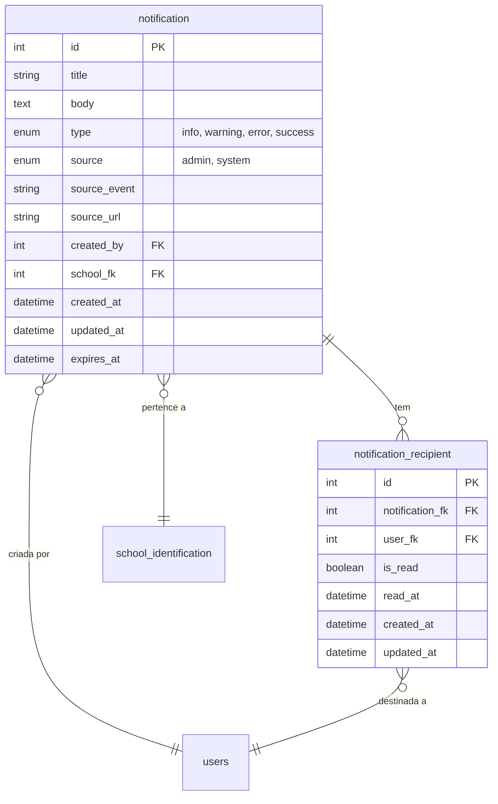

# Módulo de Notificações

---

## Documentação de Domínio

### O que é
O módulo de Notificações permite que a secretaria de educação e os gestores escolares enviem avisos e comunicados para professores, coordenadores e outros usuários do sistema. Além disso, o próprio sistema pode enviar notificações automáticas quando eventos importantes acontecem (ex.: nova matrícula criada, estoque baixo no almoxarifado).

### Funcionalidades

#### Para Administradores
- **Enviar notificação**: o administrador escreve um título e uma mensagem, escolhe o tipo (informação, aviso, erro, sucesso), e seleciona para quais perfis enviar (gestor, professor, coordenador, etc.)
- **Filtrar por escola**: é possível enviar a notificação apenas para os usuários de uma escola específica
- **Prazo de validade**: notificações expiram automaticamente depois de um período (padrão: 30 dias)
- **Visualizar envios**: o administrador pode ver os detalhes de uma notificação enviada e quem já leu
- **Excluir notificação**: remove o comunicado e todos os seus registros de leitura

#### Para Todos os Usuários
- **Inbox pessoal**: cada usuário tem sua caixa de entrada com todas as notificações recebidas
- **Indicador de não lidas**: um contador aparece na barra superior mostrando quantas notificações novas existem
- **Marcar como lida**: o usuário pode marcar uma notificação individual ou todas de uma vez como lidas
- **Notificações recentes**: um menu dropdown na barra superior mostra as 5 notificações mais recentes

#### Notificações Automáticas (infraestrutura pronta, ainda não ativadas)
O sistema possui a infraestrutura para enviar notificações automáticas quando eventos acontecem (ex.: matrícula criada, estoque baixo), mas **essa integração ainda não foi ativada nos módulos**. Atualmente, apenas notificações manuais (criadas pelo administrador) são enviadas.

Os eventos já catalogados para uso futuro incluem:
- Matrículas: criação, aprovação, rejeição, transferência
- Turmas: criação, atualização
- Almoxarifado: solicitações, transferências, estoque baixo
- Merenda: publicação de cardápio
- Profissionais: alocação, desalocação
- Sistema: manutenção, atualização

### Fluxo de Uso

1. O administrador acessa **Notificações** no menu
2. Clica em **Criar Notificação**
3. Preenche título e mensagem
4. Seleciona o tipo (informação, aviso, erro ou sucesso)
5. Opcionalmente filtra por escola e/ou perfis de usuário
6. Define prazo de validade (opcional)
7. Envia — todos os destinatários recebem instantaneamente no inbox

---

## Documentação Técnica

### Estrutura de Arquivos
```
app/
├── components/
│   ├── NotificationService.php           # Serviço central (Yii::app()->notifier)
│   ├── behaviors/
│   │   └── NotifyOnEventBehavior.php     # Behavior para auto-notificações em AR
│   └── auth/
│       └── TNotificationEvent.php        # Enum de eventos do sistema
└── modules/notifications/
    ├── NotificationsModule.php           # Módulo Yii (CWebModule)
    ├── controllers/
    │   ├── NotificationsController.php   # CRUD admin (index, create, view, delete)
    │   └── InboxController.php           # Inbox do usuário (index, unreadCount, recent, markRead, markAllRead)
    ├── models/
    │   ├── Notification.php              # CActiveRecord: tabela notification
    │   └── NotificationRecipient.php     # CActiveRecord: tabela notification_recipient
    └── views/
        ├── notifications/
        │   ├── index.php
        │   ├── create.php
        │   └── view.php
        └── inbox/
            ├── index.php
            └── _notification_item.php
```

### Diagrama ER



### API — `NotificationService` (`Yii::app()->notifier`)

| Método | Descrição |
|--------|-----------|
| `notify($userId, $title, $body, $options)` | Notificação para 1 usuário |
| `broadcast($title, $body, $filters)` | Broadcast por roles e/ou escola |
| `getUnreadCount($userId)` | Contagem de não-lidas |
| `getUserNotifications($userId, $limit, $offset)` | Lista paginada |
| `markAsRead($recipientId, $userId)` | Marca 1 como lida |
| `markAllAsRead($userId)` | Marca todas como lidas |
| `purgeExpired()` | Remove notificações expiradas |

#### Opções ($options / $filters)

| Chave | Tipo | Descrição |
|-------|------|-----------|
| `type` | `string` | `info` (padrão), `warning`, `error`, `success` |
| `source` | `string` | `admin` ou `system` (padrão) |
| `sourceEvent` | `TNotificationEvent\|string` | Evento de origem |
| `sourceUrl` | `string` | URL de redirecionamento |
| `schoolId` | `int` | Filtrar por escola |
| `targetRoles` | `array` | Roles dos destinatários |
| `expirationDays` | `int` | Dias até expirar (0 = nunca) |
| `createdBy` | `int` | ID do usuário criador |

#### Exemplos

```php
// Notificação individual
Yii::app()->notifier->notify($userId, 'Matrícula aprovada', 'Sua matrícula foi aceita.', [
    'type' => 'success',
    'sourceEvent' => TNotificationEvent::ENROLLMENT_APPROVED,
]);

// Broadcast para gestores de uma escola
Yii::app()->notifier->broadcast('Nova turma criada', 'A turma 5A foi cadastrada.', [
    'targetRoles' => ['manager'],
    'schoolId' => 42,
    'sourceEvent' => TNotificationEvent::CLASSROOM_CREATED,
]);
```

### `NotifyOnEventBehavior` — Notificações Automáticas

Attach em qualquer `CActiveRecord` para disparo automático:

```php
public function behaviors()
{
    return [
        'notifyBehavior' => [
            'class' => 'application.components.behaviors.NotifyOnEventBehavior',
            'events' => [
                'afterSave' => [
                    'title' => 'Matrícula criada',
                    'body' => function($model) { return "Aluno {$model->student->name}"; },
                    'targetUser' => function($model) { return $model->created_by; },
                    'sourceEvent' => TNotificationEvent::ENROLLMENT_CREATED,
                    'onlyNew' => true, // só INSERT, não UPDATE
                ],
            ],
        ],
    ];
}
```

### Eventos Disponíveis (`TNotificationEvent`)

| Categoria | Evento | Valor |
|-----------|--------|-------|
| Matrículas | `ENROLLMENT_CREATED` | `enrollment.created` |
| | `ENROLLMENT_APPROVED` | `enrollment.approved` |
| | `ENROLLMENT_REJECTED` | `enrollment.rejected` |
| | `ENROLLMENT_TRANSFER` | `enrollment.transfer` |
| Turmas | `CLASSROOM_CREATED` | `classroom.created` |
| | `CLASSROOM_UPDATED` | `classroom.updated` |
| Almoxarifado | `INVENTORY_REQUEST` | `inventory.request` |
| | `INVENTORY_TRANSFER` | `inventory.transfer` |
| | `INVENTORY_LOW_STOCK` | `inventory.low_stock` |
| Merenda | `FOODS_MENU_PUBLISHED` | `foods.menu_published` |
| Profissionais | `PROFESSIONAL_ALLOCATED` | `professional.allocated` |
| | `PROFESSIONAL_DEALLOCATED` | `professional.deallocated` |
| Sistema | `SYSTEM_MAINTENANCE` | `system.maintenance` |
| | `SYSTEM_UPDATE` | `system.update` |

### Rotas

| Rota | Ação | Acesso |
|------|------|--------|
| `notifications/notifications/index` | Listagem admin | Autenticado |
| `notifications/notifications/create` | Criar notificação | Autenticado |
| `notifications/notifications/view?id=N` | Ver detalhes | Autenticado |
| `notifications/notifications/delete?id=N` | Excluir | Autenticado |
| `notifications/inbox/index` | Inbox do usuário | Autenticado |
| `notifications/inbox/unreadCount` | Contagem não-lidas (JSON) | Autenticado |
| `notifications/inbox/recent` | Últimas 5 (JSON) | Autenticado |
| `notifications/inbox/markRead?id=N` | Marcar como lida | Autenticado |
| `notifications/inbox/markAllRead` | Marcar todas como lidas | Autenticado |
